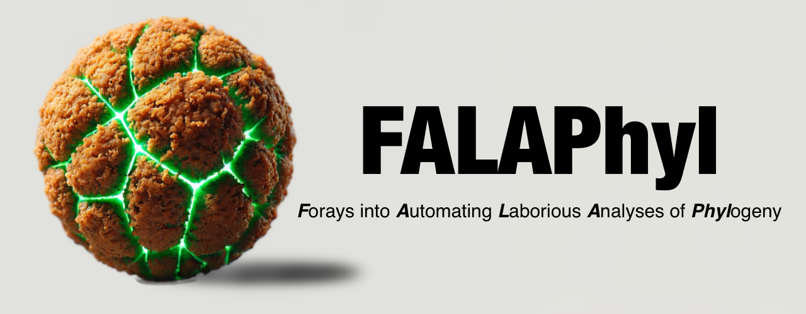

  

# FALAPhyl: *F*orays into *A*utomating *L*aboraious *A*nalyses of *Phyl*ogeny

This is a pipeline that fully automates some bioinformatic analysis using well-recognised packages such as PhyloSeq, ggplot and others. It is built on top of snakemake.

The rationale for this is to perform exploratory analysis of your feature data, and produce publication quality plots for beta diversity (Principal Coordinates Analysis - PCoA, Non-metric Multidimensional Scaling - NMDS), alpha diversity, the network connectivity Zi-Pi plot (Zi within-module connectivity, Pi among-module connectivity).

You need a features table in a biom file format, and a mapping file. If compositional beta diversity is specified (PhILR), a rooted tree is not needed as one is automatically generated using Ward Hierarchical clustering.

## How do you run it?
If you are using the docker image, you will need to mount the OS's folder as a volume:

> docker run -ti -v ~/MyLocalFolder/:/data/ khalidtab/falaphyl:latest bash

The volume mounted above should include the following files and folders:

1. [filename].biom, where [filename] is the file name that is exactly the same as the other input files (mapping file)
2. Mapping file in the [filname.].txt format, where [filename] is the file name that is exactly the same as the other input files (biom). File is in the format typically used for Qiime2. That is, first column "#SampleID", contains sample IDs that match those in the biom file, then the other columns are the additional variables you're interested in analyzing.
3. input.yaml: the file with the input parameters. This can be downloaded from this github repo, and it is also packaged in the docker image in the parent directory. If you are using the file in the docker image, it must be copied to the volume, and modified before usage. Any parameter that is not wanted should be commented with a #

To run the pipeline. Run the following command
> snakemake all alpha beta breakdown network diff subject_alpha subject_beta subject_diff --cores all --use-conda

Here is the explanation of the options:
1. all: self-explanatory. Will run all analyses.
2. alpha: alpha diversity, and violin plots of the graphs
3. beta: dissimilarity matrices, ADONIS, ANOSIM, Beta dispersion, PCoA and NMDS
4. breakdown: Jaccard and Bray-Curtis broken down to their corresponding components (per the R package Betapart). ANOSIM on the two components. Probability density function of the components through permutation.
5. network: nodes and edges based on SparCC. Zi-Pi graphs to determine which nodes are most interesting.
6. diff: differential abundance using multiple methods, using the R package DAtest. Will do pairwise comparisons of selected variables. Will output differential abundance, power analysis, and the following graphs to help identify the best method: AUC, FDR, Power, and Scores.
7. subject_alpha: For paired/repeated measures. Alpha diversity differences but restricted to differences within a subject.
8. subject_beta: For paired/repeated measures. Same as the breakdown option above, but the comparison is restricted to differences within the subject.
9. subject_diff: For paired/repeated measures. Same as the diff option above, but the comparisons is restricted to differences within the subject.
